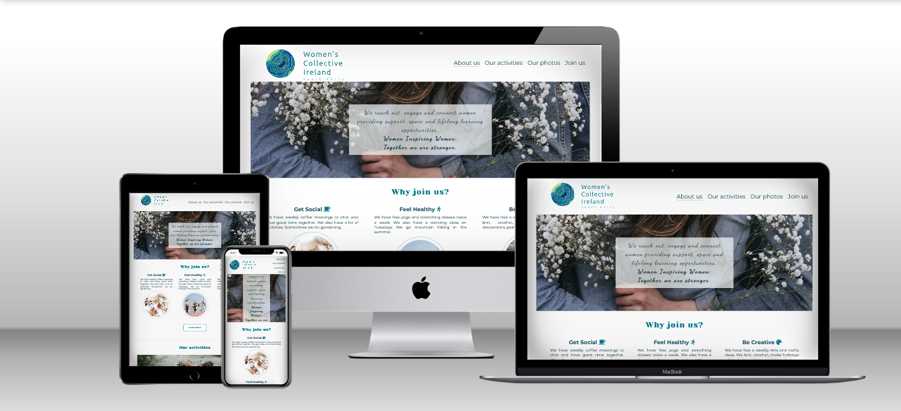
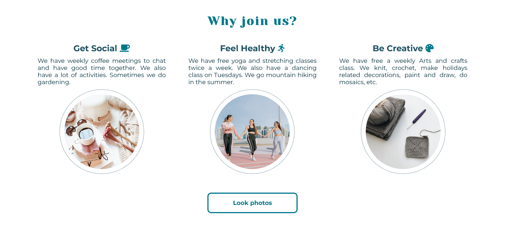
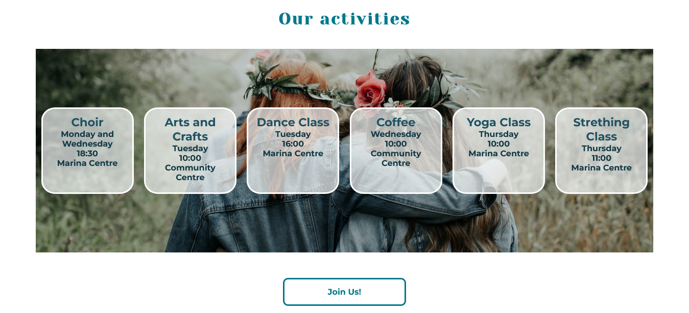
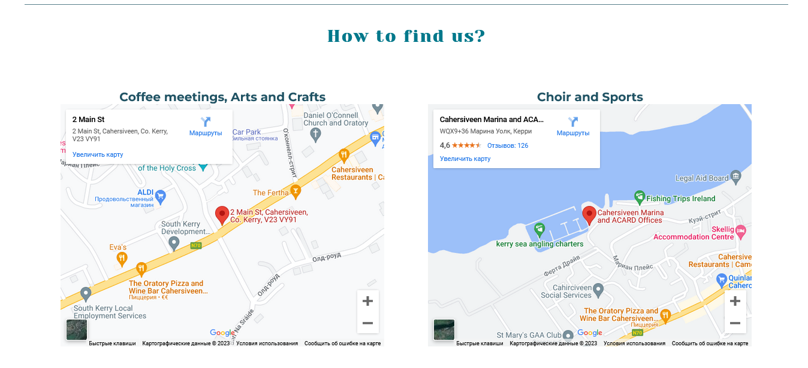
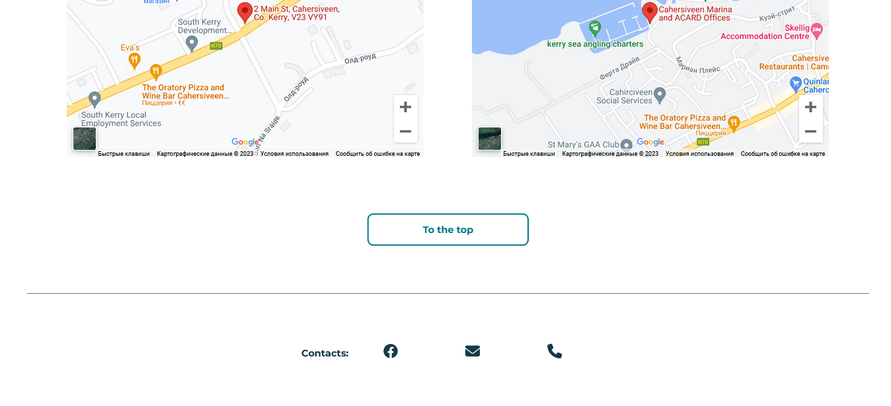
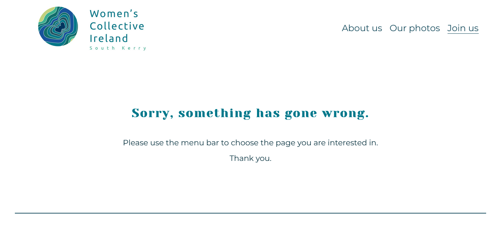
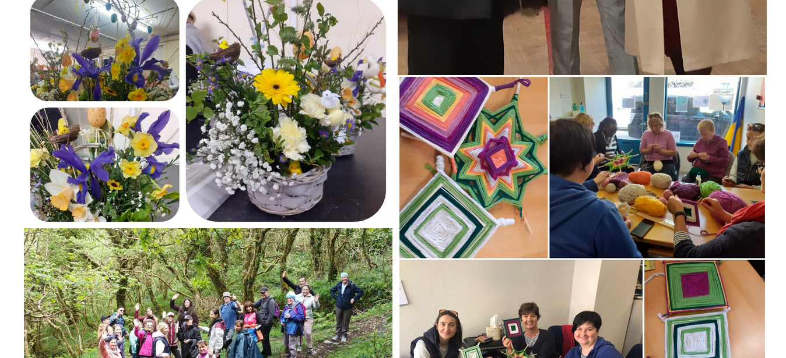
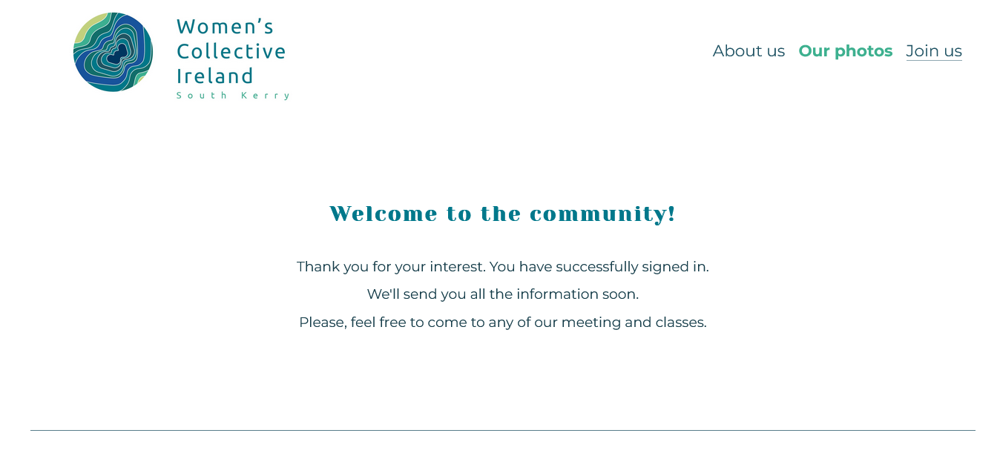

# Women's Club Cahersiveen 

Women's Club Cahersiveen is a website that provides information about the local community for women in South Kerry, Ireland. The site is targeted toward women of all ages who are looking for a way to socialise, develop, learn new skills, live actively and keep themselves fit. Women's Club Cahersiveen website will be useful to see the list of activities, days and venues the members of the community can join.
[The link to visit the website](https://natalitta.github.io/Women-club-Cahersiveen/)

## Existing Features

### Navigation Bar
* Featured on all three pages, the full responsive navigation bar includes links to the About Us (home page), Our photos and Sign Up pages, which are the same on all pages to make navigation easier.
* There's an extra link on the home page "Our activities", it leads to the corresponding section of the page.
* The active page is underlined for users' convenience.
* The logo gives the information not only about the name but also the location. 
* The logo image is clickable, it navigates to the home page.

### Favicon
* The site has a favicon implemented with the club logo. It shows an image in a browser tab so that the user can easily identify the website among other open tabs.

### Landing page

#### Main image

* The landing image contains a photo with text overlay to give the user some information about the community and its values.

#### "Why join us?" section

* Reasons section provides the user with the reasons why this community can be of interest, shows motivating photos. 
* The section "Why join us?" has a link to navigate to the gallery of photos on "Our photos" page.

#### "Our activities" section

* This section presents the timetable of all the activities available.
* The user can see the days, times and locations of all events.
* This section will be updated to keep the user up to date.
* The section also includes a link to the Sing-up page so that the user can fill in the form with their details to sing up for any of the activities.

#### "How to find us?"
* This section contains 2 google maps for the locations. 
* A user can use them to see where the evens take place and also get directions from Google maps.
* The section also includes a link to the top of the page for users' convenience so that they don't need to scroll up to the menu.

### Footer
* The footer contains contacts represented by icons as links to a social media page (Facebook), an e-mail and a phone number, so that a user can easily phone or e-mail from the site. Facebook link opens in a new tab.
* Icons are accessible to the visually impaired who may be using a screen reader, by the use of aria-labels. 

### 404 page
* The 404 page will be displayed if a user navigates to a broken link. 
* The 404 page contains the menu to navigate back to the main page or to another one.

### "Our photos" page

* The gallery provides users with photos of the activities in the community.
* It gives users an idea of what it's like to be a member of the community and even recognise someone when they first join in.

### The Sign Up Page

* This page allows the user to get signed up to be the member of the community and start their sociolising and attending meet-ups, classes and any other events they are interested in.
* The user can specify the activities they would like to take part in. The user is asked to submit their full name, email address and phone number.
* On successful submission of the sign-up form, the user will be navigated to thank-you.html displaying a welcoming message.

## Features Left to Implement

* The sign-up form will be updated with javascript to send a welcoming email to the user with detailed information about the activities they specified in the form.

## Testing
### Navigation Links
Testing was done to ensure that all navigation links navigate to the correct pages as intended. This was done by clicking on the navigation links on each page. 
* Logo image - index.html (Home page)
* About us - index.html (Home page)
* Our activities - index.html #activities-head (Home page / Activities section)
* Our photos - gallery.html (Gallery page)
* Join us - signup.html (Sign-up page)
* Look photos - gallery.html (Gallery page)
* Join Us! - signup.html (Sign-up page)
* To the top - index.html #menu (Home page top)

All the links navigated to the correct pages on all pages.

### Footer Icons / Links

* Testing was performed on the Font Awesome icons in the footer to ensure that each one opened in a new tab.
* Facebook icon opened in a new tab when clicked as expected.
* E-mail icon opened a default e-mail application ready to send an email to the target address.
* Telephone icon opened a pop-up window asking which permition to call.

### Sign-up form
The form on the sign-up page was tested to ensure it functioned as expected. The test covered situations when correct data was input and when incorrect data was input.

* Correct data:
The form was successfully submitted. The thank-you page was displayed.
* Incorrect data:
The form wasn't submit and an Error was displayed to tell the user that the field is required.
* No checkboxes selected:
The form wasn't submit and an Error was displayed to tell the user that the field is required.

### Validator Testing
* HTML: No errors were returned when passing through the official W3C validator.

